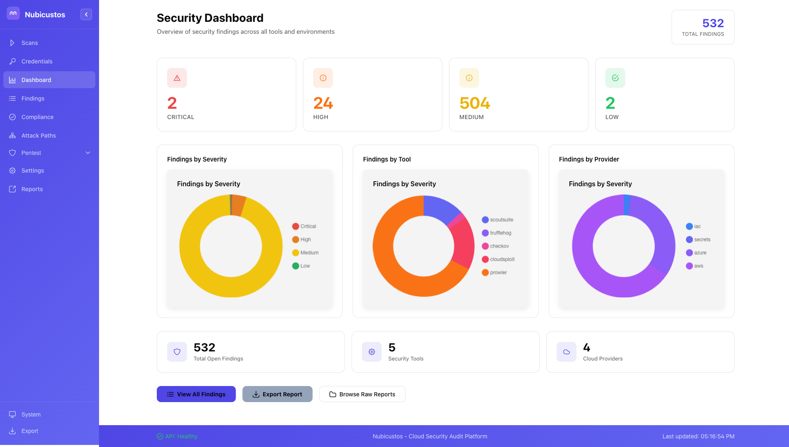
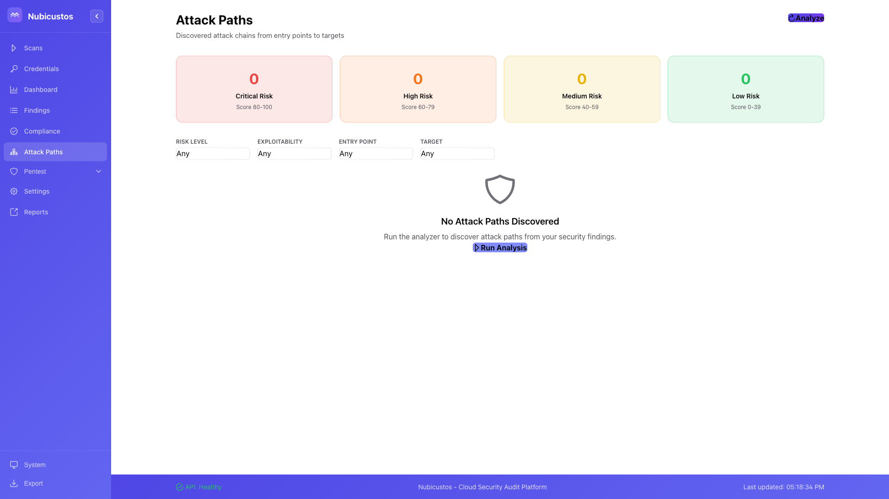
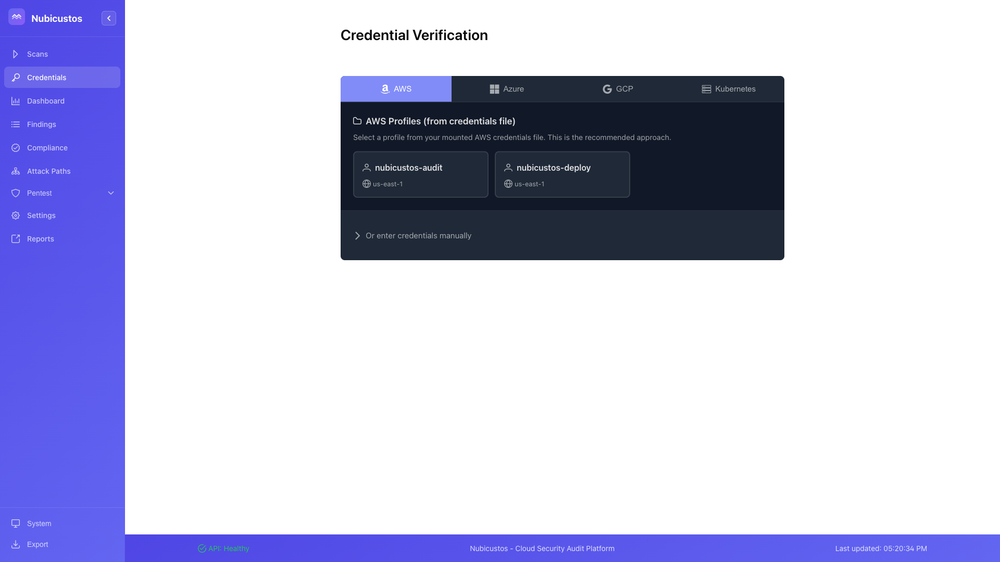

# Nubicustos

> **Cloud Security Intelligence Platform** - Transform raw security scans into actionable intelligence with attack path analysis, compliance mapping, and proof-of-concept verification across AWS, Azure, GCP, and Kubernetes.

[](https://opensource.org/licenses/MIT)
[](https://python.org)
[](https://docker.com)
[](CHANGELOG.md)
[](https://github.com/Su1ph3r/Nubicustos/stargazers)
[](https://github.com/Su1ph3r/Nubicustos/commits/main)
[](CONTRIBUTING.md)
[](#multi-cloud-support)

*Named from Latin: nubes (cloud) + custos (guardian)*

---

## Why Nubicustos?

Running security scanners is easy. **Understanding what the results mean is hard.**

Nubicustos doesn't just run tools - it transforms raw scanner output into **actionable security intelligence**:

| Challenge | How Nubicustos Solves It |
|-----------|--------------------------|
| **24+ tools, 24+ report formats** | Unified findings database with normalized severity, status, and resource mapping |
| **Thousands of findings, no context** | Attack path analysis correlates findings into exploitable chains |
| **"Is this actually exploitable?"** | Proof-of-concept commands to verify findings in your environment |
| **"Are we compliant?"** | Automatic mapping to 29+ compliance frameworks (CIS, SOC2, PCI-DSS, HIPAA, NIST, etc.) |
| **"What changed since last scan?"** | Historical tracking with MTTR metrics and trend analysis |
| **"How do I fix this?"** | Remediation knowledge base with AWS CLI commands and step-by-step guidance |

---

## Screenshots

### Security Dashboard

*Unified security posture view with findings by severity, tool, and cloud provider*

### Findings Explorer

*Searchable findings from all tools with severity filtering and CSV export*

### Compliance Dashboard

*Track compliance across 29+ frameworks including CIS, SOC2, PCI-DSS, HIPAA, and NIST*

### Scan Orchestration

*Launch scans, monitor progress, and manage credentials across cloud providers*

### Attack Path Analysis

*Discover multi-step attack chains with risk scoring and MITRE ATT&CK mapping*

### Credential Management

*Manage AWS, Azure, GCP, and Kubernetes credentials with profile selection*

---

## Key Capabilities

### Unified Security Intelligence

Nubicustos normalizes output from 24+ security tools into a single, queryable database:

- **One view for all findings** - No more switching between tool-specific dashboards
- **Consistent severity mapping** - Critical/High/Medium/Low regardless of source tool
- **Resource correlation** - See all findings for a specific resource across all tools
- **Deduplication** - Identify when multiple tools flag the same issue

### Attack Path Discovery

Go beyond individual findings to understand **how attackers could chain vulnerabilities**:

- **Graph-based analysis** - Identifies multi-step attack chains through your infrastructure
- **Entry point mapping** - Shows where attackers could gain initial access
- **MITRE ATT&CK integration** - Maps attack paths to tactics and techniques
- **Risk scoring (0-100)** - Prioritize paths by exploitability and impact
- **PoC generation** - AWS CLI commands to verify each step is exploitable

### Compliance Mapping

Automatically map findings to **29+ compliance frameworks**:

- AWS CIS Benchmarks (1.4, 1.5, 2.0, 2.1, 3.0)
- SOC 2, PCI-DSS 3.2.1, HIPAA
- NIST 800-53 (Rev 4 & 5), NIST 800-171, NIST CSF
- FedRAMP (Low & Moderate), CISA
- GDPR, ISO 27001, MITRE ATT&CK
- AWS Well-Architected Framework (Security & Reliability Pillars)
- And more...

### Proof of Concept Verification

Don't just report findings - **prove they're exploitable**:

- **PoC commands** - Generated AWS CLI commands to verify findings
- **Secret verification** - TruffleHog validates credentials are actually active
- **Privilege escalation paths** - PMapper shows exactly how to escalate privileges
- **Exploitability scoring** - Rate findings by real-world exploitability

### IAM Deep Analysis

Understand your IAM attack surface with specialized analysis:

- **Privilege escalation paths** - PMapper graph analysis showing all paths to admin
- **Policy risk analysis** - Cloudsplaining identifies overly permissive policies
- **Assumed role chains** - Track role assumption paths across accounts
- **Lambda execution roles** - Identify functions with dangerous permissions
- **IMDS vulnerabilities** - Find EC2 instances vulnerable to metadata attacks

### Historical Tracking & Trends

Security posture over time, not just point-in-time snapshots:

- **Scan comparison** - See what's new, fixed, or unchanged between scans
- **MTTR metrics** - Mean Time To Remediation tracking
- **Trend analysis** - Track finding counts over time by severity
- **Remediation velocity** - Measure your security team's effectiveness

---

## Quick Start

```bash
# 1. Clone the repository
git clone https://github.com/Su1ph3r/Nubicustos.git
cd Nubicustos

# 2. Launch the stack
docker compose up -d

# 3. Access the web interface
open http://localhost:8080

# 4. Add credentials (via UI or mount)
mkdir -p credentials/aws
cp ~/.aws/credentials credentials/aws/
cp ~/.aws/config credentials/aws/

# 5. Run your first scan
curl -X POST http://localhost:8000/api/scans \
  -H "Content-Type: application/json" \
  -d '{"profile": "quick", "aws_profile": "default"}'
```

> **Note:** Security tools run on-demand via Docker SDK - no need to pull 24+ images at startup.

---

## Architecture Overview

```
┌─────────────────────────────────────────────────────────────────────────────┐
│                              NUBICUSTOS                                      │
│                    Cloud Security Intelligence Platform                       │
├─────────────────────────────────────────────────────────────────────────────┤
│                                                                              │
│  ┌─────────────────┐    ┌─────────────────┐    ┌─────────────────┐         │
│  │  SCAN ENGINE    │    │   ANALYSIS      │    │   PRESENTATION  │         │
│  │                 │    │                 │    │                 │         │
│  │ • 24+ Tools     │───▶│ • Normalization │───▶│ • Vue.js UI     │         │
│  │ • On-demand     │    │ • Attack Paths  │    │ • REST API      │         │
│  │ • Parallel Exec │    │ • Compliance    │    │ • MCP Server    │         │
│  │ • Error Track   │    │ • PoC Gen       │    │ • Exports       │         │
│  └─────────────────┘    └─────────────────┘    └─────────────────┘         │
│           │                      │                      │                   │
│           └──────────────────────┼──────────────────────┘                   │
│                                  ▼                                          │
│                    ┌─────────────────────────┐                              │
│                    │      DATA LAYER         │                              │
│                    │                         │                              │
│                    │ PostgreSQL │ Neo4j      │                              │
│                    │ (Findings) │ (Graph)    │                              │
│                    └─────────────────────────┘                              │
└─────────────────────────────────────────────────────────────────────────────┘
```

### Integrated Tools

| Category | Tools |
|----------|-------|
| **Cloud Security** | Prowler, ScoutSuite, CloudSploit, Pacu, CloudFox, Cloud Custodian |
| **AWS Deep Dive** | Enumerate-IAM, PMapper, Cloudsplaining, CloudMapper |
| **Kubernetes** | kube-bench, Kubescape, kube-hunter, Trivy, Grype, Polaris, Falco |
| **Secrets** | TruffleHog (700+ detectors), Gitleaks |
| **IaC Scanning** | Checkov, Terrascan, tfsec |
| **Asset Mapping** | Cartography (Neo4j graph) |

---

## Scan Profiles

| Profile | Duration | Description |
|---------|----------|-------------|
| `quick` | 5-10 min | Fast security assessment - Prowler only |
| `comprehensive` | 30-60 min | Full audit with all applicable tools |
| `compliance-only` | 15-20 min | Compliance-focused checks (Prowler + ScoutSuite) |
| `secrets` | 2-5 min | TruffleHog + Gitleaks secrets scanning |
| `iam-analysis` | 10-15 min | PMapper + Cloudsplaining IAM deep dive |
| `iac` | 2-5 min | Infrastructure-as-Code scanning |

```bash
# Via API
curl -X POST http://localhost:8000/api/scans \
  -H "Content-Type: application/json" \
  -d '{"profile": "comprehensive", "aws_profile": "prod-audit"}'

# Via UI
# Navigate to Scans page → Quick Actions → Select profile → Start
```

---

## API Highlights

```bash
# Get unified findings from all tools
curl "http://localhost:8000/api/findings?severity=critical,high"

# View attack paths with risk scores
curl http://localhost:8000/api/attack-paths

# Check compliance status
curl http://localhost:8000/api/compliance

# Export findings with remediation guidance
curl http://localhost:8000/api/exports/csv -o findings.csv

# Compare scans with MTTR metrics
curl "http://localhost:8000/api/scans/compare?baseline=abc123&current=def456"

# Get privilege escalation paths
curl http://localhost:8000/api/privesc-paths
```

Full API documentation available at `http://localhost:8000/docs` (Swagger UI).

---

## MCP Server for LLM Integration

Integrate Nubicustos with Claude, GPT, or other LLMs via the Model Context Protocol:

```json
{
  "mcpServers": {
    "nubicustos": {
      "command": "python",
      "args": ["-m", "nubicustos_mcp.server"],
      "env": {
        "NUBICUSTOS_MCP_API_URL": "http://localhost:8000"
      }
    }
  }
}
```

Ask natural language questions about your security posture:
- *"What are the most critical findings in my AWS account?"*
- *"Show me all privilege escalation paths to admin"*
- *"Are we compliant with CIS 2.0?"*
- *"What attack paths exist from public-facing resources?"*

See [MCP Server Guide](nubicustos-mcp/README.md) for setup instructions.

---

## Documentation

| Document | Description |
|----------|-------------|
| [Installation Guide](INSTALL.md) | Detailed setup instructions |
| [Cheatsheet](CHEATSHEET.md) | Quick reference for common commands |
| [MCP Server Guide](nubicustos-mcp/README.md) | LLM integration via Model Context Protocol |
| [Architecture](STRUCTURE.md) | Detailed architecture documentation |
| [Contributing](CONTRIBUTING.md) | How to contribute to the project |
| [Changelog](CHANGELOG.md) | Version history and release notes |

---

## System Requirements

| Requirement | Minimum | Recommended |
|-------------|---------|-------------|
| Docker Engine | 20.10+ | Latest |
| Docker Compose | 2.0+ | Latest |
| RAM | 16GB | 32GB |
| Disk Space | 50GB | 100GB |

---

## Ports

| Port | Service | Description |
|------|---------|-------------|
| 8080 | Nginx | Web frontend |
| 8000 | FastAPI | REST API |
| 5432 | PostgreSQL | Findings database |
| 7474 | Neo4j HTTP | Graph browser |
| 7687 | Neo4j Bolt | Graph queries |

---

## Contributing

We welcome contributions! See [CONTRIBUTING.md](CONTRIBUTING.md) for guidelines.

---

## Security

Found a vulnerability? Please use GitHub's private vulnerability reporting or email maintainers directly. Do not open public issues for security concerns.

---

## License

MIT License - see [LICENSE](LICENSE) for details.

---

## Acknowledgments

Nubicustos builds on these excellent open-source security tools:

[Prowler](https://github.com/prowler-cloud/prowler) |
[ScoutSuite](https://github.com/nccgroup/ScoutSuite) |
[Kubescape](https://github.com/kubescape/kubescape) |
[kube-bench](https://github.com/aquasecurity/kube-bench) |
[Trivy](https://github.com/aquasecurity/trivy) |
[Checkov](https://github.com/bridgecrewio/checkov) |
[Falco](https://github.com/falcosecurity/falco) |
[Cartography](https://github.com/lyft/cartography) |
[TruffleHog](https://github.com/trufflesecurity/trufflehog) |
[Gitleaks](https://github.com/gitleaks/gitleaks) |
[PMapper](https://github.com/nccgroup/PMapper) |
[Cloudsplaining](https://github.com/salesforce/cloudsplaining)

See [NOTICE](NOTICE) for full attribution.

---

<p align="center">
  <strong>Turn security scanner noise into actionable intelligence.</strong>
</p>
